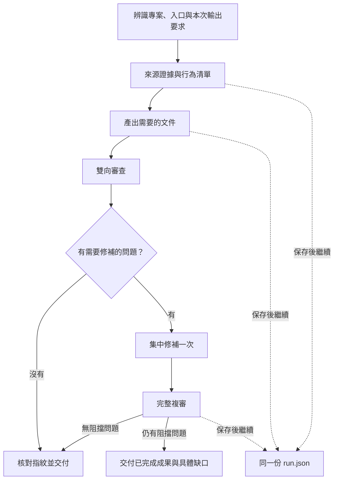

# code-analysis-package

一個跨專案的程式碼分析 plugin，以 **`code-analysis` 作為唯一 Skill 入口**。從目前程式碼追查功能、API、畫面或批次作業，依本次要求產出可追溯的分析文件，並核對正確性與重要缺漏。

Claude Code 可安裝整個 plugin；Claude Code 與 Codex 也能單獨安裝同一份 Skill。套件不綁定特定語言、框架、資料庫或文件份數。

目前版本：`0.13.0`。新版位於 [`codex/unified-code-analysis-skill`](https://github.com/jin576tw/code-analysis-package/tree/codex/unified-code-analysis-skill) 分支；取得程式碼時請指定此分支。

## 核心做法

- 依入口追查條件、正常／失敗分支、狀態、資料與外部副作用，重要結論附來源位置。
- 依讀者與交付要求，產出整合分析、SA、SD、API 契約、ERD、流程圖等需要的內容。
- 合併共用證據，分析方法按需讀取，不固定先產出多份中間文件。
- 用「文件 → 來源」查錯誤主張，用「來源／需求 → 文件」查重要缺漏。
- 正常連續執行，保存進度後接續工作；中斷時核對實際檔案後恢復。

不設 Full／Fast 模式、不逐階段評分、不在里程碑完成後例行停問。入口歧義或必要證據不足時，仍會指出缺口並完成可獨立進行的部分。



## 安裝

以下為終端機命令範例。將 `/path/to/code-analysis-package` 換成套件位置，將 `/path/to/your-project` 換成**要分析的專案根目錄**；兩者用途不同。

先取得新版分支。已有這條分支的本機 checkout，可直接使用該路徑，不必再次 clone。

```bash
git clone --branch codex/unified-code-analysis-skill --single-branch \
  https://github.com/jin576tw/code-analysis-package.git \
  /path/to/code-analysis-package
```

選擇下列一種安裝方式即可，同一工具不必同時安裝 plugin 與獨立 Skill。

### Claude Code：安裝 plugin

在要分析的專案中，將上述 checkout 加為本機 marketplace，再安裝 plugin：

```bash
cd /path/to/your-project
claude plugin marketplace add /path/to/code-analysis-package
claude plugin install code-analysis-package@code-analysis-package --scope local
claude plugin list
```

`local` 表示只供自己在這個專案使用；要供自己所有專案使用，可改用 `--scope user`。本機 marketplace 使用此 checkout，請保留資料夾供後續更新。相同 marketplace 名稱只能指向一個來源，已有舊版者請見遷移說明。

安裝完成後在目標專案開啟新的 Claude Code 工作階段，使用帶有 plugin 名稱的入口：

```text
/code-analysis-package:code-analysis 分析取消訂單功能，交付一份 SA.md。
```

本例明確使用指定分支的本機 checkout，避免未指定分支時取得舊流程。安裝與命名空間依 [Claude Code plugin 文件](https://code.claude.com/docs/en/plugin-marketplaces)；安裝範圍見 [plugin 管理文件](https://code.claude.com/docs/en/discover-plugins)。

### Codex：安裝獨立 Skill

將整個 `code-analysis` 資料夾複製到目標專案，不要只複製 `SKILL.md`：

```bash
cd /path/to/your-project
mkdir -p .agents/skills
cp -R /path/to/code-analysis-package/skills/code-analysis .agents/skills/
```

在該專案開啟 Codex，使用：

```text
$code-analysis 分析取消訂單功能，交付一份 SA.md。
```

個人共用位置為 `~/.agents/skills/code-analysis/`；新增後未出現時，重新啟動 Codex。安裝位置依 [Codex 官方 Skills 文件](https://learn.chatgpt.com/docs/build-skills)。

本 repo 提供 Claude Code plugin manifest；Codex 使用上面的獨立 Skill 方式，不把 `.claude-plugin` 當成 Codex plugin 安裝格式。

### Claude Code：只安裝獨立 Skill

若只需要 Skill，也可略過 plugin 安裝：

```bash
cd /path/to/your-project
mkdir -p .claude/skills
cp -R /path/to/code-analysis-package/skills/code-analysis .claude/skills/
```

此時入口是 `/code-analysis`，不是 `/code-analysis-package:code-analysis`。個人共用位置為 `~/.claude/skills/code-analysis/`，詳見 [Claude Code Skills 文件](https://code.claude.com/docs/en/skills)。

### 執行需求

分析使用 Claude／Codex 現有的檔案、搜尋與執行工具。`checkpoint.mjs` 使用 Node.js 內建模組，不需要 `npm install`；目前測試環境為 Node.js `24.16.0`。

沒有 Node.js 時仍能分析，可用現有 SHA-256 工具與人工紀錄核對檔案，但需說明沒有自動鎖與續跑檢查。不內建瀏覽器安裝、PDF／DOCX 產生器或外部服務連線；需要時使用專案可用且獲准的工具。

## 第一次進入專案：初始化併入分析開頭

不必先執行初始化指令。Skill 會讀取專案指引與既有 `.analysis-profile.md`，確認本次入口、範圍及輸出位置；沒有 profile 時，只從建置檔、目錄、路由或 job 定義辨識本次必要資訊。

Profile 是可選的共用設定。常在同一專案工作時，可請代理依已確認來源整理一份，記錄穩定資訊，例如：

```markdown
# 專案分析設定
- 來源根目錄：backend/、frontend/
- 已確認入口：backend/src/routes/、frontend/src/pages/
- 文件目錄：docs/analysis/
- 文件語言：繁體中文
- SA 模板：docs/templates/sa.md
- 分析慣例：現況與需求分開；外部服務未實測時明列限制
```

上例路徑必須換成實際查證的位置。Profile 不放密碼或 token；內容只作導航，實際行為仍核對目前來源。結構改變時更新受影響設定，不以舊 profile 取代查證。

| 設定層次 | 內容 | 套用方式 |
|---|---|---|
| Skill | 分析、證據、審查與續跑方法 | 各專案共用 |
| 專案指引／profile | 模組、路徑、慣例、文件目錄與模板 | 沿用有效資訊 |
| 本次要求 | 入口、範圍、讀者、交付文件與必要驗證 | 每次指定，可覆寫一般輸出偏好 |

## 使用範例

在入口後說明「分析什麼、給誰看、要哪些成果」。下例採 Codex 入口；Claude plugin 使用時換成 `/code-analysis-package:code-analysis`。

**分析功能，產出 SA：**

```text
$code-analysis
分析 backend/src/orders 的取消訂單功能，讀者為 PM 與 QA。
涵蓋權限、狀態、例外、重複操作及外部副作用。
依 docs/templates/sa.md 產出 docs/analysis/cancel-order/SA.md，附 Mermaid 流程圖。
只分析現況，不修改產品程式碼。
```

**分析 API，指定不同輸出：**

```text
$code-analysis
分析 /api/orders 的建立與取消介面。
交付 API-CONTRACT.md，列出 request／response、驗證、認證、錯誤與副作用。
不需要額外 SA 或 SD；外部服務契約與實作行為分別標示。
```

**分析批次作業：**

```text
$code-analysis
分析 billingJob，交付一份供維運使用的批次規格。
說明觸發來源、參數、step 順序、交易、失敗與重跑條件。
找不到部署排程時，列出證據缺口，不猜測執行時間。
```

**核對已有文件：**

```text
$code-analysis
核對 docs/SD.md 與目前 src/orders 的程式碼，只交付 REVIEW.md。
同時查錯誤主張與重要缺漏，不修改原文件。
```

**中斷後續跑：**

```text
$code-analysis
讀取 .analysis/docs/cancel-order/run.json，核對指紋與來源範圍，
沿用仍有效的成果，接續未完成工作。
```

未指定格式時，預設產出一份整合分析。需要多份文件就明列交付清單；涉及多個模組不會自動增加文件份數。使用者模板優先，未提供時才採最小預設骨架；不要求另填模式或 JSON 輸出契約。

## 輸出與審查

未指定輸出位置時，預設使用 `.analysis/docs/<feature>/`：

```text
.analysis/docs/cancel-order/
├── ANALYSIS.md     # 或本次指定的 SA.md、SD.md 等文件
├── REVIEW.md       # 審查範圍、問題與限制
└── run.json        # 檔案指紋、revision、已完成事項與待辦
```

範圍與證據先放分析附錄；多文件需要共用時才拆出 `EVIDENCE.md`。需要保留多次執行歷史時才使用 `_run/<run-id>/`，續跑沿用原 run。核對既有文件時可以只新增審查紀錄與必要快照，不重新生成分析；純排版／轉檔則做適用的呈現與內容一致性檢查。

**本版沒有預先定義的分析 agent 檔案，但仍可使用一個獨立審查子代理。** 主代理完成分析，環境提供且允許子代理時，由一個 Reviewer 自行核對來源。沒有需修補問題就不再複審；需修補時集中處理一次，再完整複審。非阻擋用字建議不啟動新一輪。

| 判定 | 意義 |
|---|---|
| `verified` | 獨立雙向審查完成、當前指紋一致、必要內容與證據齊全，無未解阻擋缺陷 |
| `self_reviewed` | 只有主代理自查，不能稱為獨立審查通過 |
| `review_pending` | 本次要求的必要審查尚未完成 |
| `blocked` | 缺少影響交付正確性的來源或必要執行證據 |
| `accepted_with_exceptions` | 使用者明確接受已列出的偏差 |

`run.json` 的 `done` 只代表執行進度；指紋一致只代表被追蹤檔案未變，兩者都不能自行證明分析正確或來源清單完整。

## 從舊版遷移與後續更新

`0.13.0` 已移除 `/analysis-init`、`/start-analysis`、`/verify-code`、分層 skills、數字評分 agents、舊 harness 模板與 PowerShell 工具。改用唯一 `code-analysis` 入口；功能分析方法收在新版 references，PDF 等轉檔工作交由適合的文件工具處理。

保留既有 profile 與分析文件即可，不需要刪掉專案產物。舊 harness 狀態不是新版 `run.json`；接續舊工作時，提供既有文件與來源範圍，重新核對後建立新版紀錄，不直接把舊 PASS 當成新版通過。

Claude plugin 若原本指向遠端預設分支，先依安裝段落將同名 marketplace 改為指定分支的本機 checkout。更新該 checkout 後，在原本安裝的專案執行：

```bash
git -C /path/to/code-analysis-package pull --ff-only
cd /path/to/your-project
claude plugin marketplace update code-analysis-package
claude plugin update code-analysis-package@code-analysis-package --scope local
```

原本使用其他安裝範圍者，更新時使用相同範圍，完成後重新啟動 Claude Code。獨立複製 Skill 的使用者需同步更新整份資料夾；若曾自行修改，先比對與保留修改，避免直接覆蓋或巢狀複製成兩層同名目錄。

## 套件結構與驗證

```text
code-analysis-package/
├── .claude-plugin/         # Claude plugin 與 marketplace metadata
├── skills/code-analysis/
│   ├── SKILL.md            # 唯一分析入口
│   ├── references/         # 按需分析、交付、審查與續跑說明
│   ├── assets/             # 分析模板
│   ├── scripts/checkpoint.mjs
│   ├── agents/openai.yaml  # Codex 顯示 metadata，不是子代理定義
│   └── LICENSE
├── tests/code-analysis/    # 工具測試與合成分析樣本
├── docs/code-analysis-skill.md
├── README.md
├── CHANGELOG.md
└── LICENSE
```

在此 repo 執行：

```bash
node --test tests/code-analysis/checkpoint.test.mjs
claude plugin validate .claude-plugin/plugin.json --strict
claude plugin validate .claude-plugin/marketplace.json --strict
claude plugin validate skills --strict
```

工具測試涵蓋真實檔案異動、缺檔、版本衝突、活動鎖、部分修補恢復、路徑越界與無效輸入。另有一個隔離案例完成獨立雙向審查與實際中斷續跑；詳見 [設計與驗證紀錄](docs/code-analysis-skill.md)。

尚未在獨立 Claude Code 執行環境及 Windows 完成端到端實測，也未量化長期 token／時間節省。Skill 不能保證平台永不中斷；保存與核對的用途是減少恢復時的重做。

授權：[MIT](LICENSE)。舊流程沿革保留於 [CHANGELOG](CHANGELOG.md)，不作目前操作指南。
