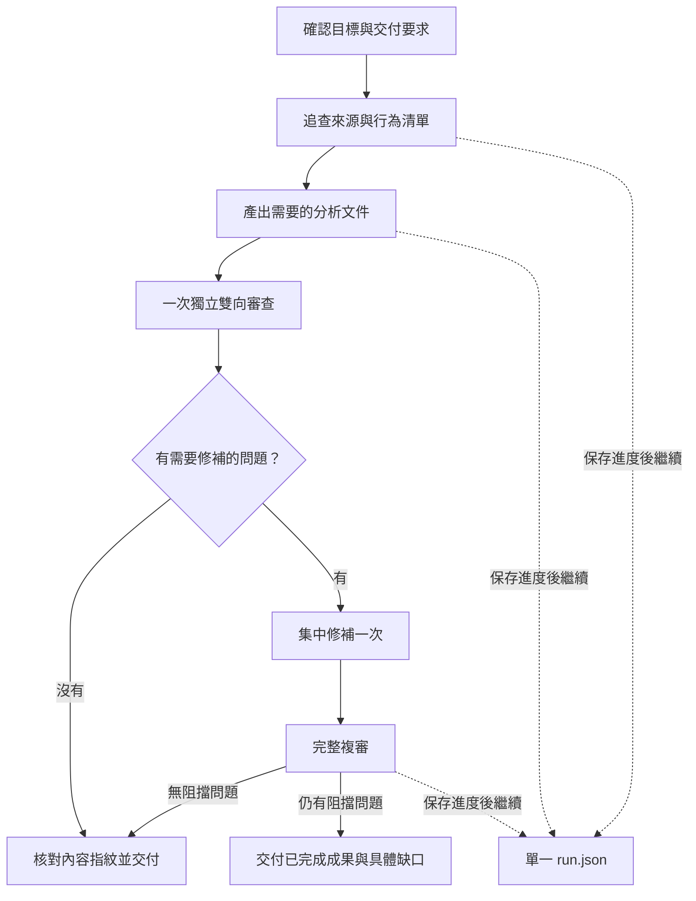

# 單一 code-analysis skill

入口：[SKILL.md](../skills/code-analysis/SKILL.md)。整個 `skills/code-analysis/` 可單獨複製，包含授權、按需參考資料與一支零外部依賴 Node.js 輔助工具。
本文件說明新版設計與驗證；不是 skill 執行時必讀的另一層流程。

## 蒸餾後的流程



- 不分模式，不逐階段打分，不固定產出九份中間文件。
- 目前主代理是 Maker；可用且獲准時使用一個獨立 Reviewer，未修補不再做第二輪。
- 正常連續執行，不在 checkpoint 後停問或要求換 session；無法防止平台／程序中斷，能從已保存內容恢復。
- 範圍與證據優先放文件附錄；多文件共用時才拆出 EVIDENCE.md。預設為分析文件、REVIEW.md、run.json 三類產物。
- 小任務可合併盤點與草稿保存；分批讀取依來源群組，不每個欄位都派工或產出狀態文件。
- UI 靜態覆蓋、必要執行證據、交付圖片分別判斷；不因 UI 存在就強制 Mock 或瀏覽器安裝。

## 從歷史案例保留的防護

| 歷史失效模式 | 新版對應 |
|---|---|
| 逐輪抽樣換一批問題，修很多輪仍未達分數 | 一次全掃、具體缺陷、集中修補上限 |
| 文件沒寫出的分支不會被一般審閱抓到 | 文件→來源與來源／需求→文件兩方向核對 |
| 修補夾帶新的未證實主張 | 問題 ID、限定修補範圍、重讀內容、完整複審 |
| 從另一份摘要重建 SQL／交易而失真 | 共用來源證據；可執行語意回查 literal source |
| 可靜態推導的條件被要求人工確認 | 先列條件與結果；外部契約先查可用套件／schema |
| 狀態標已修，但文字沒更新 | 實際檔案指紋與逐項修補落地核對 |
| 工具未實作卻退出成功 | 未知命令、無效輸入與不一致狀態全部非零退出；正負向測試 |

這些規則依先前對話所讀的分析歷史蒸餾。可重用 skill 不攜帶內部系統名稱、私人記憶庫路徑或特定專案事實。

## handover-analysis 分支取捨

比較基準：`main` 的 `de00553` → `origin/handover-analysis` 的 `7c95011`，三個提交、27 個檔案。

| 分支提交 | 採用 | 調整 |
|---|---|---|
| `24126af` | 按需載入、來源去重、一次修完整集合、區分平台中斷 | 不保留數字評分或每種 collector 的代理 |
| `e897fe0` | 進度保存、revision、明確下一步、已完成成果復用 | 不強制每單元換 session；hash 涵蓋實際來源和文件；單一狀態檔；允許有影響說明的部分恢復 |
| `7c95011` | 圖片需求與執行驗證分類分離 | 圖片由交付需求決定，不普遍強制生成示意圖 |

未合併該分支。舊版分支仍是原來的流程與 PowerShell 實作；新版不依賴它的腳本或 gate schema。

## 安裝與使用

整份複製 `skills/code-analysis/`，不要只複製 SKILL.md：

| 工具 | 專案安裝位置 | 呼叫例 |
|---|---|---|
| Claude Code | `.claude/skills/code-analysis/` | `/code-analysis 分析取消訂單，交付一份 SA` |
| Codex | `.agents/skills/code-analysis/` | `$code-analysis 分析取消訂單，交付一份 SA` |

官方依據（2026-09-06 查核）：[Claude Code](https://code.claude.com/docs/en/skills)、[Codex](https://learn.chatgpt.com/docs/build-skills)。
以 Claude Code plugin 安裝時，使用 `/code-analysis-package:code-analysis`；獨立複製 skill 時才使用上表短名稱。
自 `0.13.0` 起，plugin 僅保留此 skill，舊 `/analysis-init`、`/start-analysis`、`/verify-code` 與分層指令已移除。完整安裝與更新方式見 [README](../README.md)。
Node.js 僅用於輔助工具，無 npm install；無 Node.js 時依 skill 說明以可用雜湊工具完成核對並揭露續跑能力限制。

例：`分析 src/orders.mjs 的取消訂單功能，涵蓋權限、狀態、例外與副作用，交付 ANALYSIS.md。`
續跑：`讀取 .analysis/docs/cancel/run.json，核對指紋後接續未完成工作。`
驗證：`核對既有 SD.md 與目前程式碼，只交付差異，不修改原文件。`

## 驗證方式與界線

輔助工具測試：

```sh
node --test tests/code-analysis/checkpoint.test.mjs
```

測試包含真實檔案變動／缺檔、狀態損壞、版本衝突、活動鎖、任務識別、完成工作倒退、來源追蹤消失、部分修補續跑、審查指紋、路徑越界與未知命令。
工具驗證的是版本與檔案完整性；不以 `valid:true` 證明分析正確、清單完整、代理獨立或所有工具都有被呼叫。

行為驗證使用獨立代理，僅提供隔離複製的 skill、合成來源與實際使用者要求；不提供預期答案。產品程式不修改，無遠端環境或發布副作用。
來源樣本在 [order-fixture.mjs](../tests/code-analysis/order-fixture.mjs)。

### 實際結果（2026-09-07）

| 驗證 | 結果與證據 |
|---|---|
| Node.js 輔助工具 | 20／20 測試通過，涵蓋正向保存、異動偵測與拒絕無效狀態 |
| Skill 格式與攜帶性 | skill-creator 的 quick_validate 通過；內部參考連結均可在整份 skill 內解析；不依賴舊版 skills |
| 獨立實跑 | 隔離代理以合成取消訂單功能產出分析，經一名獨立 Reviewer 雙向核對，無阻擋問題 |
| 真實中斷續跑 | 草稿完成後中斷；從 revision 1 的 source-inventory／draft 接續 independent-review／finalize，最後 revision 2、done、pending 為空 |
| 成果復用 | 續跑前後來源與分析文件指紋相同；新增審查紀錄，未重寫原草稿、未重新分析已完成範圍 |
| 流程負擔 | 該案例未詢問是否繼續、未要求 profile 訪談、未評分、未強制換 session、未建立額外分析中間文件，也未因兩個非阻擋用字建議啟動修補迴圈 |

實跑核對包含權限、空訂單、已取消、已出貨、回補庫存、保存失敗、退款失敗與重複／並行呼叫的靜態風險。
分析未把回傳物件的 status 說成已驗證 HTTP 路由，也未把 refundPending 說成已有持久化重試機制。

這次實跑驗證的是「來源與草稿未變動的中斷恢復」；檔案變動與部分修補恢復由輔助工具測試覆蓋，尚未做另一個完整代理情境。
未在獨立 Claude Code 安裝環境或 Windows 執行，也未測試真實資料庫、退款服務或瀏覽器。
格式相容不等於兩平台所有版本都已實測；單一案例不能量化長期 token／時間節省，也不能保證平台永不中斷。

### Plugin 清理驗證（0.13.0）

- 移除 61 個舊流程檔案，僅保留一個可發現的分析 Skill；新版 Skill 的 10 個檔案與行為未變。
- Claude Code CLI 對 plugin manifest、marketplace manifest 與 skills 目錄的 `--strict` 驗證均通過。
- 確認 plugin／marketplace 版本一致、18 個本機文件連結可解析，且無殘留舊工具相依。
- 複製完整 Skill 至隔離專案後，輔助工具可正常載入並拒絕不存在的 run；20／20 快照工具測試再次通過。
- 本次驗證針對套件清理、安裝資料夾結構與工具執行，沒有另外安裝到使用者的業務專案或重跑完整模型分析。
